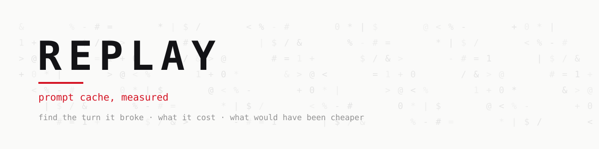
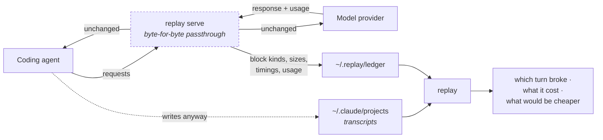

<div align="center">

<picture>
  <source media="(prefers-color-scheme: dark)" srcset=".github/assets/wordmark-dark.svg">
  
</picture>

<br>

**Unit economics for agentic work. What one task costs, and the share of it nobody chose to spend.**

[](https://github.com/RedRobotKK/Replay/actions/workflows/ci.yml)
[](LICENSE)
[](go.mod)
[](go.mod)
[](#install)

[Install](#install) · [Cost per task](#cost-per-task) · [What it prints](#what-it-prints) · [Commands](#commands) · [Docs](docs/) · [Evidence](docs/evidence/) · [Roadmap](docs/ROADMAP.md)

[](https://buymeacoffee.com/saitodaniel)

```sh
curl -fsSL https://redrobot.jp/replay.sh | sh
```

</div>

---

Your provider reports spend. Your dashboard reports spend. Neither reports **cost per task**, or
what share of that cost was waste, because working it out means replaying each session against the
provider's caching rules. That is what this does.

```text
$ replay cost ~/.claude/projects/

Cost per task, across 1363 sessions priced at list rates (anthropic-2026-09-01).

  total          $2850.77
  median task    $0.65
  p90 task       $2.30
  avoidable      $152.94  (5% of the total)
```

That run is from 2026-09-05 and is the same corpus as
[`docs/evidence/`](docs/evidence/). It grows, so the totals move; the rate and the
median do not. Point it at your own sessions rather than trusting these figures.

Five percent of that bill was paid twice, because a prompt cache broke and nobody was told. The
median task cost 65 cents and the p90 cost $2.30, which is the spread you need before you can price
a feature, a customer, or an agent that runs unattended. High growth hides bad unit economics until
it doesn't.

It reads the transcripts your agent already writes, reproduces the provider's caching turn by turn,
and only then scores alternatives. Later, as a local proxy, it applies the better layout live using
only mechanisms the provider itself sanctions, and keeps improving from your own history.
Everything runs on your machine. No API calls are spent on analysis. Nothing leaves.

> [!NOTE]
> **Status: v0.3.0 released.** `replay`, `blame`, `diff`, and
> `redact` work offline on Claude Code transcripts and have been calibrated against **1363 real
> sessions** across many unrelated projects, reproducing 26571 of 27302 turns (97.32%). They are all
> from one machine, so the roadmap's independence requirement is not met even though its session
> count is met many times over. `serve` is a byte-for-byte passthrough proxy that records a derived-data ledger, **verified against the real provider** on 2026-09-05: ten turns,
> all 200, 1.8M prompt tokens measured, no credentials and no message text in the ledger. It
> also reads OpenAI-compatible traffic, which is verified against a test stub only. Follow
> [`docs/ROADMAP.md`](docs/ROADMAP.md).

<div align="center">

|  | Command | What it answers | Tier |
|:--:|---|---|:--:|
| 💵 | `replay cost` | What one task costs, and what share was waste | measured |
| 🔍 | `replay context` | What filled the context, by tool | measured |
| 🧭 | `replay route --to <model>` | Whether switching models pays, and where the cache-read inversion sits | structural |
| ✂️ | `replay trim --cap <n>` | What a byte cap would save, and what it would break | estimated |
| 🛡️ | `replay advise --guards` | Spend caps derived from your own spread | measured |
| 🩺 | `replay doctor` | What Replay can see here, and which guards fired | — |
| 📡 | `replay serve` | The proxy: measured tier, guards, secret masking | measured |

</div>


### Sharing what you find

`replay cost <dir> --share` prints a block designed to be posted:

```text
  ────────────────────────────────────────────────────

  5% of my agent spend was paid twice.

    sessions      1384      median task   $0.65
    cache breaks  729       p90 task      $2.29

  Not a forecast of savings. Tokens already billed twice
  because a prompt cache broke and nothing said so.

  Measure yours:  github.com/RedRobotKK/Replay
  ────────────────────────────────────────────────────
```

**It leaves out the spend total on purpose.** A total tells a reader your monthly burn and
lets them infer team size and runway, which is the figure a company would regret posting. It
is also the least interesting number here, because it is not comparable: $3,000 means nothing
without knowing how many engineers spent it. **A rate reads the same from a solo developer and
a team of fifty**, which is what makes it worth comparing at all.

No paths, no project names, no session contents. The card goes to stdout and the accompanying
note to stderr, so `replay cost <dir> --share | pbcopy` copies exactly what is safe to paste
and nothing else.

> [!TIP]
> Every figure carries a **truth tier**. `measured` came off the wire. `estimated` used the
> byte-to-token fit and says so. `structural` is dimensionless and survives a change of tokenizer.
> Nothing is printed without one.

---

> [!TIP]
> **This is free and stays free.** The measurements behind it are not: the corpus above is
> 1363 real sessions and about $2,851 of the maintainer's own API spend, and the next
> provider needs the same again. If Replay found a cache break that was costing you real
> money, [the tip jar](https://buymeacoffee.com/saitodaniel) is how the R&D gets paid for.
> There is nothing to buy and nothing gated.

## 🔍 What is filling your context

Claude Code tells you how full the window is. It does not tell you what is
filling it, and that is the part you can act on.

```text
$ replay context ~/.claude/projects/<project>/session.jsonl

Session fee79714  998k tokens of content entered this context

  Bash                                29.2%    291k  x562  *
  assistant                           22.8%    228k  x606
  mcp__claude-in-chrome__computer     17.8%    178k  x276  *
  Write                                3.6%     36k  x34   *
```

Ranked by size now, not by cost across the session: a small file read on turn
one is carried by every later request and dominates a cost ranking while
occupying almost nothing.

### The gap, measured rather than disclaimed

**It measures what entered the context, not what is still in it.** The
attribution never subtracts, so anything the provider cleared, or that
compaction removed, is still counted.

A warning printed on every session is a warning nobody reads. So the sessions
where the gap is real are detected and sized, and the sessions where the figures
are exact say so:

```text
Complete: nothing was cleared or compacted in this session, so every block
counted here is still in the context.
```

```text
OVERSTATED: content left this context and the attribution above does not
subtract it. The provider cleared 120k tokens over 3 context edits, so these
figures overstate by at least 30%.
```

```text
OVERSTATED: ... The history was compacted 1 time, which reports no size at
all, so the overstatement cannot be measured.
```

Three states, and the third is the important one: when the size is not
recoverable, no percentage is quoted. A measured overstatement is reported as a
number; an unmeasurable one is reported as unmeasurable rather than estimated
into something that looks like a number.

**The awkward part, said plainly:** the sessions most likely to be overstated
are the ones that took this tool's own leading advice, because context editing
is what `replay` recommends. Fixing the underlying attribution means teaching it
to subtract, which is real work and is not done. Until it is, the tool reports
which of its own numbers it does not fully stand behind.

<a id="cost-per-task"></a>

## 💵 Cost per task

```sh
replay cost ~/.claude/projects/            # the summary above
replay cost --per-task ~/.claude/projects/ # every session, most expensive first
replay cost --json ~/.claude/projects/     # for a dashboard, or an agent
```

The unit is one session, because a session is the closest thing a transcript has to a task.

**No mean.** One forty-hour session drags an average somewhere no real task lives, and a person
planning against "average task: $12" is planning against a number that describes none of their work.
The median and the p90 are what the conversation actually needs.

**Avoidable is not a forecast.** It prices the tokens a provider re-billed because a cache broke:
money already spent twice, not a projection of what a different layout might save. Sessions whose
model is not in the price table are excluded and counted, never treated as free.

## ⚡ Live, while you can still do something about it

Claude Code tells you what a session has cost. It cannot tell you how much of
that was avoidable, because it does not price cache misses. Replay does, on the
JSON Claude Code already hands a status line, in about 6ms per render:

```text
$18.40  cache 91%  $3.10 avoidable  tools changed
```

```sh
replay statusline --install   # prints the settings.json snippet
```

It opens no files and makes no network call: it is arithmetic on data the client
already computed, priced with the rules document above. When the figure it
computes exceeds what the session actually cost, the two disagree and it shows
the cause without the number, because the one to doubt is ours.

## 🔌 Works with

Stated as a boundary rather than a row of logos, because the two paths support different things.

| | Offline, from transcripts | Live, through the proxy |
|---|---|---|
| **What it needs** | Files your agent already wrote | `ANTHROPIC_BASE_URL` pointed at `127.0.0.1` |
| **Clients** | Claude Code (the only transcript format parsed today) | Any client that can be pointed at a local base URL |
| **Figures** | `estimated`, inferred from transcript bytes | `measured`, read off the wire |
| **Costs an API call** | No | No. It is a passthrough; your agent's calls are the only calls |

Other agents and other providers cache by different mechanisms, and pretending one model fits all of
them would be worse than saying this. The shape a second provider needs is worked out in
[`docs/architecture/multi-provider.md`](docs/architecture/multi-provider.md).

## 🧩 How it fits



**What it touches:** transcript files it reads, and a ledger it writes, both owner-only on your
machine. **What it never touches:** your credential, which appears nowhere in the source, and the
bytes of your requests, which are forwarded before they are parsed. **What it never does:** make a
network call to anything except the provider you configured.

<a id="what-it-prints"></a>

## 🖨️ What it prints

Real output from one Claude Code session, the session in which Replay itself was written. It is a
paste from a single run, not a summary.

```text
Tier: estimated (transcripts only)
Calibration: reproduced provider cache reads on 315/319 turns (7 read more than predicted: a sibling request extended the prefix); 4 cache breaks
Assumption: replayed savings assume the agent would have behaved identically under the alternative layout
Rules: anthropic-2026-09-01; user-content fit 0.469 tokens/byte ±64% from 34 turns; system prefix 39k (measured from the first request's cache read)

  policy                                    prompt tokens  cached share  vs as-run  misses  guardrail
  as-run                                           22.87M           97%          -       0
  ttl-5m0s                                         22.87M           91%       +35%       4  none
  ttl-1h0m0s                                       22.87M           97%        +0%       0  none
  context-edit(keep=6,trigger=239k) *              20.98M           79%     +206%       0  re-read rate and failed edits: unknown until a live trial

  turn 32 at 22:08:56 (+2m30s): read 39k of 228k expected, 189k re-billed
    cause: client re-rendered history after the system prefix (no edit visible in transcript)
    where: message 0 (user text)
    evidence: read 38987 tokens, about the size of the system prefix (38547); the message history was re-billed from the first message
```

The calibration line is the point. Replay first proves it can reproduce what the provider charged,
and only then says anything about alternatives. Here the 1-hour TTL the client chose reproduces
as-run to the token, the 5-minute TTL would have cost 35% more across four idle gaps, and context
editing would have cost more, not less, for this session shape.

Every figure is labeled **estimated** (inferred from transcripts) or **measured** (read off the
wire), with the calibration that justifies it. The aggregate across every session measured so far is
in [`docs/evidence/`](docs/evidence/), which reports **26571 of 27302 turns reproduced across 1363
sessions (97.32%)**, names the 429 sessions that fell below the 95% threshold rather than dropping
them, and is candid that every session came from one machine. For one model it reports that provider
behaviour changed and declines to score alternatives at all.

Add `--dollars` for a list-price column computed from a dated first-party price table; the output
names the table date because prices change and other platforms differ.

How it works: [`docs/architecture/replay-engine.md`](docs/architecture/replay-engine.md).

## 🚧 Who should not use this yet

- **You need numbers you can put in front of finance today.** The offline tier is `estimated`. Run
  the proxy for `measured` figures, and read the calibration line before quoting either.
- **You are not on Claude Code, and you want the offline reader.** Transcript analysis parses one
  format: Claude Code's JSONL. Nothing else is read from disk. Cursor, for instance, keeps its
  sessions in SQLite and records no cache accounting at all, so a reader for it could report spend
  and never waste.

  The proxy is a different answer and a better one, but it is **not** agnostic, and an earlier
  version of this line said it was. It understands two request shapes: `/v1/messages`, verified end
  to end against the real provider, and `/v1/chat/completions`, which Cursor, DeepSeek and Grok
  speak and which is **verified against live DeepSeek** on 2026-09-05 across chat, streaming, a
  cache hit and the reasoner, with the token invariant holding on every one. **Anything else is forwarded byte for byte
  with every guard, the ledger and the masker inert.** That was silent until v0.2.0; it now warns
  once per path and counts `replay_unparsed_requests_total`. Secret masking does not cover
  `/v1/chat/completions` either, and the proxy says so at runtime rather than letting you assume it.
- **You want a dashboard or a hosted service.** There is neither. There is no account, no telemetry,
  and no server: the only network call is your agent's own traffic to your provider.
- **You want it to change your prompts for you.** It does not. It reports, and the guards that can
  refuse a request are off unless you turn them on.

## 👣 Operational footprint

What running this actually costs you, measured rather than asserted.

| | Cost |
|---|---|
| **API calls for analysis** | None. Analysis reads files; it never calls a model |
| **Tokens spent by Replay** | Zero. It is a passthrough, so your agent's calls are the only calls |
| **Latency added by the proxy** | **~1.7ms p50** on a 45KB request, measured against an instant local provider so nothing hides in it. A real round trip is hundreds of milliseconds to minutes, so this is a rounding error of the request it sits inside. The 48µs first published here was the difference of two noisy percentiles and could not have detected otherwise ([method and correction](docs/evidence/proxy-latency-2026-09-03.md)) |
| **Disk** | A ledger of block kinds, sizes, timings and usage counts. No message text, paths hashed, owner-only |
| **Telemetry** | None. No account, no install-time question, no first-run prompt. `replay corpus --submit` is the only thing that ever transmits, it prints the exact payload, and it waits for you |
| **Licence obligations** | Apache 2.0. No copyleft, no attribution beyond [`NOTICE`](NOTICE) |

## 🎯 Why

Coding agents resend the whole conversation on every turn. Three things go wrong quietly:

- **You cannot see what a task cost** until the invoice arrives.
- **Prompt caches break silently.** A timestamp in a system prompt or a reordered tool list can
  double the bill with no error anywhere.
- **Secrets leave the machine.** API keys and tokens in tool output ride along in the prompt.

Replay addresses each one locally, without changing how the agent works.

<a id="install"></a>

## 📦 Install

```sh
curl -fsSL https://redrobot.jp/replay.sh | sh
```

Downloads the released binary for your platform and verifies it against the release checksums.
**An unverifiable download aborts**; pass `--no-verify` to accept one deliberately. Falls back to
building from source when no release is tagged. Set `REPLAY_BIN_DIR` to choose where it lands. Read
the script first if you would rather not pipe to a shell; it is short.

With Go already installed:

```sh
go install github.com/RedRobotKK/Replay/cmd/replay@latest
```

Or from a clone:

```sh
make build && ./bin/replay doctor
```

<details>
<summary><strong>Verifying a release</strong></summary>

The checksums the installer fetches come from the same origin as the archive, so that check defends
against corruption, not against a compromised release. Verify the Sigstore signature if that is your
threat model.

No release is tagged yet. When one is, every release carries `checksums.txt` signed with Sigstore
keyless signing, built only by CI from the tag. Verify before running:

```sh
cosign verify-blob --certificate checksums.txt.pem --signature checksums.txt.sig \
  --certificate-identity-regexp 'https://github.com/RedRobotKK/Replay/.*' \
  --certificate-oidc-issuer https://token.actions.githubusercontent.com checksums.txt
sha256sum --check --ignore-missing checksums.txt
```

Until then, build from source as above.

</details>

## 🚀 Quick start

No proxy, no configuration, no trust required.

```sh
replay doctor                                        # what is on this machine, and what to run next
replay ~/.claude/projects/<your-project>/
```

<a id="commands"></a>

## 🛠️ Commands

| Command | What it does |
|---|---|
| `replay <dir>` | Reproduce caching turn by turn, then score alternative layouts. `--dollars` adds a list-cost column |
| `replay blame <dir>` | Rank what is eating prompt tokens |
| `replay diff <dir>` | Locate and classify every cache break |
| `replay corpus <dir...>` | Calibration summary across sessions, as Markdown. No paths, no content |
| `replay advise <dir...>` | Turn the largest token sources into suggestions with predicted savings |
| `replay advise --apply <dir...>` | Propose the one setting evidence can decide, show the diff, and refuse when the evidence does not support a single answer. `--yes` writes it, `--json` emits it for an agent |
| `replay learn <dir...>` | Re-score the policy catalog, select one with held-out checks |
| `replay doctor` | What Replay can see on this machine, and what to do next |
| `replay cost <dir...>` | Cost per task across sessions, and the share of it nobody chose. `--per-task` lists them, `--json` emits them, `--share` prints a card that is safe to post |
| `replay context <transcript\|dir>` | What entered a session's context, by tool, ranked by size. `--json` for a dashboard |
| `replay cost --compare <date>` | Cost per task before and after a date, with the task volume on both sides. `--predicted` judges a forecast against what actually happened |
| `replay statusline` | Live spend, cache health, and what the misses are costing, in Claude Code's status line. `--install` prints the settings snippet |
| `replay rules [--update <src>]` | Show the provider rules in effect and where they came from, or install a dated document. `--dry-run` validates without installing |
| `replay redact <file>` | Strip content, keep structure and usage, for bug reports |
| `replay serve` | Local proxy: byte-for-byte passthrough, records a ledger |

| Command | What you get |
|---------|--------------|
| `replay <path>` | Reproduces your sessions' caching, prints how well it matched the provider's own numbers, then scores alternative layouts in tokens saved |
| `replay blame` | Ranks which files and blocks are eating your prompt tokens, per session |
| `replay diff` | Points at the exact turn where the cached prefix diverged and classifies the cause |
| `replay doctor` | What Replay can see on this machine (transcripts, proxy variable, a running proxy, ledger) and the next command to run |
| `replay corpus` | Calibration summary across every session in a directory, as Markdown with no paths or content, for reporting how well Replay understands your sessions |
| `replay learn` | Re-scores the policy catalog over your own history and selects one, or says none |
| `replay advise` | Turns the largest token sources across sessions into suggestions, tracked to closure |
| `replay serve` | Local proxy: byte-for-byte passthrough that records what the provider charged, so the commands above run on measured data (policies and guards are implemented; see below) |

Every flag: [`docs/guide/commands.md`](docs/guide/commands.md). Release sequence, gates, and what is
deliberately deferred: [`docs/ROADMAP.md`](docs/ROADMAP.md). Full requirements:
[`docs/requirements.md`](docs/requirements.md).

## 📡 Measured numbers, with the proxy

Transcripts give you estimated figures. Putting Replay in the request path gives you measured ones, read off the wire, and the ledger it writes holds block kinds, sizes, timings and usage counts, never message text.

<details>
<summary><b>Read the full proxy walkthrough</b></summary>
<br>

Transcripts do not contain the system prompt, tool definitions, or cache markers, so figures from
them are labeled estimated. The proxy sees all of it:

```sh
./bin/replay serve                                  # listens on 127.0.0.1:4000
export ANTHROPIC_BASE_URL=http://127.0.0.1:4000     # in the shell that runs your agent
./bin/replay ~/.replay/ledger/                      # same commands, measured tier
```

What the proxy does and does not do:

- **Forwards every byte** of every request and response, including streaming, cache markers, and the
  `anthropic-beta` and `anthropic-version` headers. By default it never rewrites a body or removes a
  header. Two opt-in features do, and say so: `--mask` rewrites secrets in the body, and a
  context-edit policy adds the provider's parameter. Rehydration also drops `Accept-Encoding` so the
  response can be read.
- **Forwards your credential** and never stores or logs it. A Claude subscription stays the active
  credential when no API key is set, as the client's gateway documentation describes.
- **Writes no message text, ever.** One ledger file per session with block kinds, sizes, labels,
  timings, and usage, under `~/.replay/ledger` with owner-only permissions.
- **Binds loopback only**, refuses browser-originated requests, and accepts an optional shared token
  (`--token` or `REPLAY_TOKEN`, sent as `x-replay-token`).
- **Fails open.** If anything inside Replay's own bookkeeping fails, the bytes still flow. If the
  provider is unreachable you get a 502 that says how to bypass Replay.
- **Has an off switch.** `REPLAY_DISABLED=1` refuses to start; unsetting `ANTHROPIC_BASE_URL`
  bypasses it entirely.

Added latency, measured with a 45KB request against an instant local provider, 300 requests after
warm-up: **~1.7ms p50** on top of the round trip. Provider latency is two to three orders of
magnitude larger, so the overhead is a rounding error of the request it sits inside.

A figure of 48µs was published here first and is wrong — not because the proxy got slower, but
because it was the difference between two separately-measured percentiles whose jitter was far
larger than the quantity being measured. Regenerate it yourself with `go test ./internal/proxy -run
'^$' -bench BenchmarkAddedLatency`; the method and the correction are in
[`docs/evidence/proxy-latency-2026-09-03.md`](docs/evidence/proxy-latency-2026-09-03.md).

<details>
<summary><strong>What the proxy watches while it runs</strong></summary>

Every response's cache read is checked against the expectation from the previous request, and a break
is logged the moment it happens with the tokens re-billed and the likely cause. Because the proxy
hashes the tool definitions and system prompt of every request, a break caused by a changed prefix is
named with certainty, which a transcript can only infer.

After every turn the proxy also re-scores the session's candidate layouts (5-minute and 1-hour TTLs,
context editing at two triggers) with the same simulator `replay replay` uses, from measured usage.
This is a dry run: nothing changes on the wire, and the live figures are exactly what `replay replay`
prints for the same ledger. `GET /replay/status` returns per-session totals (requests, prompt tokens,
cached share, breaks, prefix changes, list cost) and the `what_if` rows, each with a `vs_as_run` delta
and how a user would turn it on, as JSON. `GET /replay/metrics` exposes the totals as Prometheus text.
Both honor the token when one is set and refuse browser origins. Every ten requests a session gets one
log line naming its best candidate or saying none beats what ran.

</details>

<details>
<summary><strong>Guards: spend caps, error budget, loop detection, breaker, retries</strong></summary>

All off unless you set them (see `replay serve -h`):

- `--max-session-tokens` and `--max-day-tokens` refuse the *next* request once a cap is reached, never
  a response in flight. `--max-session-usd` and `--max-day-usd` do the same at list price from the
  dated price table (a model not in the table counts as free, and the status endpoint shows the same
  figure). The refusal is a provider-shaped error the agent shows you; send
  `x-replay-override: <reason>` to proceed once.
- `--error-budget 0.3` refuses a session's next request once that share of its prompt tokens carried
  error content: failed tools, failed edits, repeated identical calls, overflow notices. It trips
  before the spend cap because an agent stuck on failures burns money on nothing; sessions under ten
  thousand prompt tokens are never judged. The same figure is `error_share` on `/replay/status`, and
  `replay replay` on the ledger names what failed.
- `--loop-warn` and `--loop-block` count how many times in a row the agent has just made the same tool
  call with the same input, and add a warning header or refuse the request. A repeated command earlier
  in the session never counts; only the current run does. `x-replay-override` passes a block once.
- `replay trim <dir> --cap <bytes>` scores a per-block byte cap on tool output against your own
  sessions, offline. It reports the saving in dollars at cache-read prices, because a resent byte
  is a cache read and pricing it as fresh input overstates by about ten times, and it runs a harm
  probe asking whether the agent later needed what the cap removed: a later `Edit` whose
  `old_string` sat only in the removed region, a re-read of the same path, a quote of a removed
  line. The probe is a lower bound and prints its own blind spots. Nothing is trimmed and no
  request is touched; the live trimmer does not ship.
- `replay doctor` prints a **guards** block: how many requests were refused and by which guard,
  what today has cost at list price, and a loud warning when a dollar cap is configured but some
  traffic could not be priced, because then the cap is not being applied to that traffic and you
  believe you have a limit you do not have.
- `replay advise <dir> --guards` suggests caps from your own ledger using Tukey's upper fence,
  `Q3 + 1.5*IQR`, over your session spend. It prints the quartiles and the session count it used,
  refuses below ten sessions rather than dressing up a guess, and writes nothing: a spend cap the
  tool set for you is a refusal you did not choose.
- `--breaker-failures` opens a circuit after consecutive provider failures and answers locally with
  `Retry-After` until the cooldown passes, so the agent stops burning retries against a provider that
  is already saying no. It counts client requests, not attempts: one request that exhausts `--retries`
  is one failure, because the circuit is observed once on the final outcome. The two flags therefore
  do not multiply the count, but they do multiply the **time**. With `--retries 3` and backoff, each
  failure the breaker sees can take several seconds of retrying to arrive, so `--breaker-failures 5`
  opens after five slow requests rather than five quick ones. If you want the circuit to protect you
  sooner, lower the failure threshold rather than assuming the retries got you there faster.
- `--retries` resends a request up to that many times on rate limit, overload, server error, or
  connection failure, with doubling jittered backoff from `--retry-base` capped at `--retry-max`, and
  the provider's `Retry-After` in place of the backoff when it fits under the cap. A retry can only
  happen before any byte of a response has reached the client, never on a client error, never once a
  stream has started, and never after the request was sent: a connection that drops after sending may
  already have been billed, so only a failure to connect is resent. The ledger records the count per
  request; the log names each attempt and its reason.

</details>

<details>
<summary><strong>Live policies: context editing and parallel-sibling holds (experimental, off by default)</strong></summary>

`--context-edit-trigger <tokens>` asks the provider to clear old tool results server-side once the
prompt passes the trigger, keeping the last `--context-edit-keep` (default 6). Replay adds the
provider's `context_management` parameter after the client's own bytes, which stay byte-identical, and
only on requests whose client already enabled the context-management beta and set no such parameter
itself. The decision is made at a session's first request and pinned. Each edit is logged with body
hashes before and after, never content; the ledger records which requests carried it and the
provider's applied edits and cleared tokens, so `replay replay` on the ledger shows what it did.
`--policy-file ~/.replay/policy.json` applies the context-edit candidate `replay learn` selected
instead, read at each session's first request; an explicit trigger flag wins over the file. Either way
the decision is pinned on disk, so a session keeps its first decision through a rewritten file or a
restarted proxy. A learned policy runs as a bounded trial: `--trial-share 0.5` applies it to half of
new sessions by a stable hash of the session id and holds the rest out as controls, and
`--guardrail-reread 0.5` reverts it for new sessions once `--revert-after` treated sessions (default
two) show a re-read rate after the provider's clears at or above that share. The revert is persisted
and survives restarts; a newer `replay learn` result lifts it. An explicit trigger flag is your own
decision and is never split or reverted. `REPLAY_NO_POLICY=1` forces every policy off. The parameter
shape follows the provider's documentation and has not yet been exercised against the real provider
(roadmap spike 4); the `what_if` rows tell you what it should save before you turn it on, and the
`re_reads` figures (file reads that repeated a path already in context, before and after the
provider's first clear) tell you whether the agent is paying the savings back by re-reading.

`--hold-siblings 10s` is the `hold-parallel-siblings` policy. The provider's cache entry becomes
readable only once the first response that writes it begins streaming, so sub-agents started together
with the same tools and system prompt all pay the write price. With the flag on, a request whose
prefix is already in flight and not yet cached waits for that first response to begin, then goes out
and reads the entry; the value bounds the wait, a request with another prefix never waits, and a
prefix that had a response begin within the short cache lifetime holds nobody. The wait is on the
ledger record as `held_ms`, in the log line, and on status and metrics, so the cost of the policy is
visible next to its saving in the following record's cache read. Off by default.

</details>

> [!NOTE]
> One client caveat from the gateway docs: with a non-first-party base URL, Claude Code disables MCP
> tool search unless `ENABLE_TOOL_SEARCH=true` is set. Replay forwards `tool_reference` blocks
> unchanged, so setting it is safe. Details:
> [`docs/architecture/proxy-protocol.md`](docs/architecture/proxy-protocol.md).

</details>

## 🧠 Learn from your own sessions

```sh
replay learn ~/.claude/projects/* ~/.replay/ledger
```

Re-scores the policy catalog (both cache TTLs and context editing at four triggers) over every session
with the replay simulator, then selects one with rules built for a corpus of tens of sessions: a
minimum number of sessions that actually carry evidence, a margin above noise, a repeat on held-out
sessions chosen by a stable hash, and ties to the simpler policy judged on the paired per-session
difference ([ADR-0006](docs/adr/0006-learning-selection.md)). The verdicts and the selection go to
`~/.replay/policy.json` in a documented format
([`docs/architecture/policy-file.md`](docs/architecture/policy-file.md)). On a small corpus the honest
answer is "none", and that is what it says. Reads files only; never the network.

## 💡 Get told what to change

```sh
replay advise ~/.claude/projects/* ~/.replay/ledger
```

Turns the largest token sources across every session into suggestions with a predicted saving: tool
inputs that dominate prompts (long heredocs), tool results that should be truncated, files read again
and again, first-turn instruction files that every request re-carries, tool definitions a session
never calls (visible in the ledger), and cache breaks to look at with `replay diff`. Each prediction
assumes the target is halved and is stated as a share of prompt tokens first, the scale-free metric,
then as tokens across the corpus. Suggestions are tracked to closure: pending until the newest
sessions show the target shrinking, then applied, then verified or not verified against the
prediction. Written to `~/.replay/advice.json`.

## 🔐 Secret masking (experimental)

A second layer, not a guarantee. It is honest about its limits below, and the limits matter more than the feature: a 32-character API token and a 40-character git SHA are the same string to an entropy test, so masking is done by context rather than by shape.

<details>
<summary><b>Read how masking works, and what it cannot catch</b></summary>
<br>

```sh
replay serve --mask [--project .] [--mask-patterns ~/.replay/patterns.txt] [--rehydrate-scope name=dest,dest]
```

Replaces secrets in outbound request bodies with placeholders before anything leaves the machine, and
restores them in responses where the scope allows. Only the matched bytes inside JSON string values
change; every other byte is forwarded as sent, and thinking blocks and signatures are never read or
changed in either direction. The same secret always maps to the same placeholder, an HMAC under the
vault key, so the cached prefix stays stable across turns and sessions and the secret the model writes
back is masked again on the next request. The mapping lives in `~/.replay/vault`, encrypted with
AES-256-GCM under a key file that sits beside it with owner-only permissions, and survives restarts.

> [!WARNING]
> **Treat masking as a second layer under not-sending-secrets, never as the first.** The vault key
> file sits beside the ciphertext. **That file is the whole boundary**: anyone who can read the
> directory can decrypt the vault. Masking turns secrets that were transient in flight into secrets
> at rest on your machine, and nothing is evicted, so leave `--mask` off unless you want that trade.
> Two further limits are in [What masking does not catch](#what-masking-does-not-catch) below, and
> the failure mode of each is silent.

<details>
<summary><strong>Patterns, entropy, and scoped rehydration</strong></summary>

The pattern set is named, not complete: Anthropic, OpenAI, AWS access key ids, GitHub, GitLab, Slack,
Google API keys, Stripe, private key blocks, JWTs, bearer tokens, and credentials embedded in URLs,
plus your own patterns from a file with one `name<TAB>regexp` per line. On the repository's labeled
corpus the set scores precision 1.00 and recall 1.00; that is a statement about the corpus, not about
your secrets. `--mask-entropy` adds a heuristic for credentials no pattern names: a run of 32 or more
base64 characters that mixes cases and digits, changes character class often enough not to be an
identifier, has no path-shaped segment, and has high entropy. It is reported as pattern `entropy` and
scored on its own corpus (precision 1.00, recall 1.00 on 10 positives and 15 negatives covering
hashes, uuids, identifiers, paths, URLs, and timestamps). Off by default, because a guess by shape can
mask a value that was not a secret, and that value then reaches the model as a placeholder.

Rehydration is scoped ([ADR-0004](docs/adr/0004-masking-and-scoped-rehydration.md)), because content
the agent reads can tell the model to write a placeholder into a command. By default a placeholder is
restored in assistant text and in the input of a file-edit tool (`Edit`, `Write`, `MultiEdit`,
`NotebookEdit`, and the common editor tool names) whose path is under `--project` (default: the
directory `replay serve` runs in). Shell tools, network tools, tools Replay does not recognize, edits
outside the project, and edits without a path keep the placeholder. `--rehydrate-scope` changes that
per pattern: `--rehydrate-scope github-token=none` never restores GitHub tokens,
`--rehydrate-scope url-credential=text,edit,tool:Bash` lets URL credentials into shell commands, and
`*` sets the default. `--rehydrate=false` masks without restoring, to evaluate coverage. Every
response's restored and denied placeholders are counted by destination in the log, the ledger record,
`/replay/status`, and `/replay/metrics`, never with a value or a path.

What rehydration costs and where it stops: a tool call's input is delivered when its block ends rather
than as it streams, because the path that decides the scope can arrive after the placeholder; a text
delta ending in bytes that could begin a placeholder waits for the next delta. Responses are requested
uncompressed, and a response the provider compresses anyway, or one over the proxy's size limit, is
forwarded untouched with a log line. A placeholder the model spells with JSON escapes is not
recognized and stays a placeholder. A file edit receives a secret only when the tool's own path field
is present and every path-like field in its input is under the project, so a decoy in-project path
beside the real target does not open the scope; symbolic links are resolved along the part of a path
that exists, and a link the edit is about to create cannot be. `REPLAY_NO_POLICY=1` turns masking and
rehydration off with the policies.

</details>

<details>
<summary><b>🔓 What masking does not catch</b></summary>

<a id="what-masking-does-not-catch"></a>

`--mask` is useful and it is not a guarantee. Three limits, stated plainly because the failure mode
is silent and the consequence is a leaked credential.

**Hex and lowercase secrets are not caught by shape.** A 32-character Twilio token and a
40-character git SHA are the same string to any entropy test, and the SHA actually scores *lower*
(3.63 bits against 3.91). Masking every hex run would corrupt the diffs, checksums and tool output a
coding agent reads all day, so Replay does not. It catches these by **context** instead: a name that
says the value is a credential, sitting next to the value, as in `TWILIO_AUTH_TOKEN=…` or
`"apiKey": "…"`. **A bare hex secret with no name beside it passes through.**

**If the vault cannot be written, the request is forwarded unmasked.** Replay fails open everywhere,
and masking is not an exception: a full disk or an unwritable vault directory means secrets Replay
had already matched go to the provider in cleartext. It logs `MASKING FAILED … forwarded UNMASKED`,
but in a backgrounded `serve` nobody reads that. **If masking must not fail silently for you, do not
background the proxy.**

**The vault is only as private as its directory.** The key file sits beside the ciphertext. Anyone
who can read that directory can decrypt it, and nothing is ever evicted, so turning masking on
converts secrets that were transient in flight into secrets at rest on your machine.

The published precision and recall figures are a statement about the corpus in
`internal/masking/testdata/`, not about your secrets. **Treat masking as a second layer under
not-sending-secrets, never as the first.**

</details>

</details>

## ⚖️ Forensics, guardrails, and cache inversion

Three offline commands and four local guards. The commands read the ledger and
nothing else; the guards answer requests locally rather than forwarding them.

### Cache-read inversion (`replay route`)

A price list compares input tokens. Your bill does not, once most of your
prompt is a cache read: a model that costs more per input token can be cheaper
per turn if its cache-read multiple is better, and the crossover is a real
number you can compute.

```bash
replay route <ledger-or-transcripts> --to <model>
```

On the development corpus, 8,083 turns at a 99.6% hit rate:

```text
                            claude-opus-5  claude-fable-5-1
cache read multiple                 0.100             0.025
break-even trim, 5m                 91.8%             97.7%
break-even trim, 1h                 94.8%             98.6%

Cache-read inversion at a 95.24% cached share: claude-fable-5-1 is cheaper
per turn above it, claude-opus-5 below.

sigma (tokenizer dilation, claude-opus-5 -> claude-fable-5-1): unmeasured
Dollar figures are suppressed.
```

**Read that carefully, because it is two claims and only one of them is
measured.** The 95.24% boundary is structural: it comes from read multiples and
the price ratio, no token count enters it, so no tokenizer can move it. Whether
*your* traffic sits above that line is measured. What it would actually cost in
dollars is **not**, and the command refuses to say.

The missing piece is sigma, the ratio between two tokenizers on the same
content. Absolute cross-model figures need it, and it is measured from both
sides of the wire or it does not exist here. There is no default of 1.0 and no
constant on a rate card, because at a 99% cached share this comparison breaks
even at sigma = 1.0627, so a plausible-looking 1.15 would not be a safety
margin. It would be the deciding vote, cast by a number nobody measured.

Run both models over comparable work and the dollar figures fill themselves in.

### Trim auditing (`replay trim`)

Offline scoring for a per-block byte cap on tool output, plus a probe asking
whether the agent later needed what the cap would have removed.

```bash
replay trim <ledger-or-transcripts> --cap 16384
```

Over 197 real sessions, on 2026-09-05:

```text
79 blocks over the cap, 9.46M prompt tokens once resending is counted.
Worth $4.70 at cache-read prices, which is what a resent byte costs.
Priced as fresh input it would read $47.00, 10.0x larger and wrong.
Harm probe: 73 cases where the agent later needed removed content.
```

The corpus grows, so run it on yours rather than trusting the cents here. The
ratio is the durable part: a resent byte is a cache read, and pricing it as
fresh input overstates by about ten times whatever the totals are.

**$4.70 is the whole prize, and it is why the live trimmer does not exist.**
Building one means surviving three problems: Go's `json.Marshal` HTML-escapes
`<`, `>` and `&`, so decode-cut-re-marshal returns a block up to six times the
cap on HTML, JSX, XML and git conflict markers, which destroys the idempotence
the design rested on; un-trimming a block previously sent trimmed is itself a
history edit, so a restart without the flag or a changed cap corrupts a live
session; and trimming before masking cuts a secret into a prefix matching no
pattern, forwarded in clear, under an operator reading "0 secrets masked".

Ten minutes of measurement against real data answered that, rather than
months of building it and finding out.

The harm probe is a **lower bound** and prints its own blind spots: `Write` has
no `old_string`, line numbers carried into a later `Read` are invisible to it,
and removing test failures produces *fewer* later edits, which it would score as
a saving rather than as damage.

Use `--context-edit-trigger` instead. It is provider-sanctioned, invalidates the
cache only from the earliest cleared block, and the provider reports what it
did.

### The four guards

```text
client request
      |
      v
  spend cap ---------- over budget? ---> 400, locally
  error budget ------- too much error? -> 400, locally
  loop detector ------ same call again? -> 400, locally
  circuit breaker ---- provider failing? -> 503, locally
      |
      v
  upstream (with --retries and backoff)
```

Every refusal is logged with the session and the numbers, and appended to the
ledger, so a guard that saved you money overnight is something you can read back
rather than a gap where the request log stopped.

- **Spend caps**, per session and per UTC day, in tokens or dollars. The day
  counter is persisted, because a daily cap that resets on restart is the
  protection disappearing for exactly the threat it exists to stop.
- **Error budget**, which counts every agent lane of a session against that
  session's own prompt tokens. Both sides of that ratio cover the same traffic;
  a quiet sub-agent cannot erase a busy one's errors.
- **Loop detector**, on the current run of identical tool calls only.
- **Circuit breaker**, which counts *client requests*, not attempts. One request
  that exhausts `--retries` is one failure, so the two flags do not multiply the
  count — but they do multiply the time, and `--breaker-failures 5` opens after
  five slow requests rather than five quick ones.

Policy trials are scoped per policy: breach counters and the reverted flag are
keyed by the policy's parameters and its generation timestamp, so a breach
gathered against one trigger never reverts another, and reverting one policy
never disarms the guardrail for the next one.

### Diagnostics

```bash
replay doctor                              # guards block: refusals, today's cost, warnings
replay advise <ledger-or-transcripts> --guards   # caps from your own spread
```

`doctor` shouts when a dollar cap is configured but some traffic could not be
priced, because then the cap is not being applied and you believe you have a
limit you do not have.

`advise --guards` derives caps with Tukey's upper fence, `Q3 + 1.5*IQR`, over
your own sessions, and prints the quartiles and the session count behind them.
It refuses below ten sessions rather than dressing up a guess, and it writes
nothing: it cannot be combined with `--apply`, because a spend cap the tool set
for you is a refusal you did not choose.

## 📊 Contributing a calibration corpus

The roadmap gate for the first release is calibration on twenty real sessions. If you have Claude Code
transcripts, this produces a report that contains no paths, project names, or content:

```sh
make build
./bin/replay corpus ~/.claude/projects > docs/evidence/calibration-corpus-$(date +%F).md
```

Open it, check that nothing in it identifies your projects, and commit it on a branch. The report also
judges calibration per model with the newest sessions on their own, so a provider rule change shows up
as "provider behavior changed" rather than as a silent drift in the numbers, and it bounds the minimum
cacheable prefix from your usage next to what the rules file says. `replay learn` scores no
alternatives for a model reported that way.

## 📚 Documentation

Start at [`docs/`](docs/README.md), which is indexed by why you came.

| Where | What is there |
|---|---|
| [`docs/guide/`](docs/guide/README.md) | Getting started, every command and flag, troubleshooting |
| [`docs/evidence/`](docs/evidence/README.md) | The measurements behind the claims above |
| [`docs/architecture/`](docs/architecture/README.md) | How the replay engine and the proxy work |
| [`docs/adr/`](docs/adr/README.md) | Architecture decision records |
| [`docs/ROADMAP.md`](docs/ROADMAP.md) | What ships when, and why |
| [`docs/requirements.md`](docs/requirements.md) | Current requirements, with build status |
| [`docs/maintainers.md`](docs/maintainers.md) | How this repository is run |

<details>
<summary><b>🧪 Development</b></summary>

Requires Go 1.24+, [golangci-lint](https://golangci-lint.run/) v2, and Node 22+ (Markdown lint only).

```sh
make ci       # lint, test, build, docs-lint: exactly what CI runs
make build    # ./bin/replay
make help     # all targets
```

</details>

## 🤝 Contributing

Read [`CONTRIBUTING.md`](CONTRIBUTING.md) first. Bugs and features go through the issue templates.
Security reports go through [`SECURITY.md`](SECURITY.md), never a public issue.

## 🤖 Who maintains this

Replay is built and maintained by **Daniel Saito** at [Red Robot K.K.](https://redrobot.jp), a
studio in Tokyo working on production AI, data platforms and security.

The quickest way to reach me about Replay is an [issue](https://github.com/RedRobotKK/Replay/issues)
or a [discussion](https://github.com/RedRobotKK/Replay/discussions). For anything else,
[redrobot.jp](https://redrobot.jp), [LinkedIn](https://www.linkedin.com/in/danielsaito/) or
[X](https://x.com/saitodaniel).

Replay is free and the source is all here, so there is nothing to buy. If it found a cache break
that was costing you real money, there is a [tip jar](https://buymeacoffee.com/saitodaniel).

## 📄 License

Open source under the [Apache License 2.0](LICENSE). See [`NOTICE`](NOTICE) for attribution. The
decision is recorded in [ADR-0005](docs/adr/0005-apache-2-license.md).
