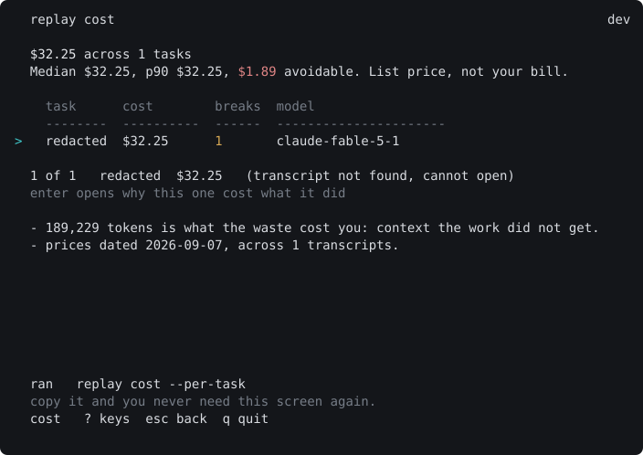
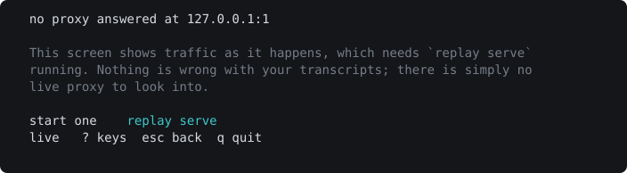

# Replay

**Your prompt cache expired while you were at lunch.** Replay finds the turn it happened on, and
what that one turn cost.

If you already run ccusage, this is the next question rather than a replacement for it. ccusage
tells you what you spent, and it is better at that than anything here. Replay answers something
narrower: which turn got billed twice, and what changed on that turn to cause it. A total and a
cause are different questions, and only one of them is answered by adding numbers up.

When a prompt cache breaks, the provider re-bills the whole conversation history at write prices.
Nothing errors. Nothing warns. The only trace is a bill that looks like ordinary growth in usage.
Replay replays your sessions against the provider's caching rules, turn by turn, and names the one
that broke.

```sh
curl -fsSL https://redrobot.jp/replay.sh | sh
```



`replay tui` puts the same answers on ten screens, one keystroke apart. The images in this README
are generated from those screens and checked against them by a test, so a screenshot here cannot
drift from what the tool prints. The doctor and safe screens are deliberately absent from
[docs/screens](docs/screens). Doctor renders your machine, and one of its rows counts days from the
compiled price table to today, so an image of it is correct for one day and wrong after. Safe lists
what Replay has written to your disk, and a picture of somebody else's byte counts is not an answer
to "what does this thing know about me". Both would be illustrations pretending to be readings;
`cmd/replay/screens_svg_test.go` holds the list and the reasons.

If you are pointing an agent through the proxy, `l` answers the question the transcripts cannot:



Reading it first is reasonable, and the script is written expecting you to:

```sh
curl -fsSL https://redrobot.jp/replay.sh | less                  # read it
curl -fsSL https://redrobot.jp/replay.sh | sh -s -- --dry-run    # see what it would do
```

It verifies a checksum and refuses to fall back to building from source when it cannot verify.
Release binaries are on the [releases page](https://github.com/RedRobotKK/Replay/releases) if you
would rather skip the script.

Then, with no proxy, no configuration, no account and no arguments:

```sh
replay
```

```text
Cost per task, across 115 sessions (1631 agent lanes) at list prices dated
2026-09-07 (caching rules anthropic-2026-09-01).

  total          $3172.41
  median task    $0.77
  p90 task       $2.30
  avoidable      $156.72  (5% of the total)
                 33.3M tokens re-billed

Avoidable is the part nobody chose: tokens re-billed because a prompt cache
broke. It is not a forecast of savings, it is what was already spent twice.

On a subscription seat - Claude Pro or Max, Copilot, Cursor - none of that is
money: you are not billed per token, so the dollars above are list price for
someone who is. The tokens are still yours.

What they cost you instead is not established. Whether a re-billed token draws
down a rate-limit window was measured here across 3.09M tokens and the
utilisation counter did not move: a null result, not a saving. `replay advise`
ranks what to cut by token count, which is the part that was measured.
```

Those are one machine's numbers on 2026-09-07, generated by running the command rather than typed
into this file. They are a session count, not a transcript count: a session writes one transcript per
agent lane, and the three totals published before this one disagreed with each other because that
distinction was lost between them. Point it
at yours, or give it a directory of your own.

**The avoidable figure is stated twice on purpose.** Most of the people who run this hold a flat seat,
and a dollar figure addressed to someone else reads as a number that does not apply — which is how a
real finding gets dismissed. The tokens apply to everyone: a re-billed token is context the work did
not get, on a window you are rate-limited against either way. Whether a break also burns a
subscription quota the way it burns a bill is measured, unresolved, and
[written up as null](docs/evidence/quota-titration-2026-09-06.md) rather than assumed in either
direction.

`transcripts` counts files, not sessions: a session writes one transcript per agent lane, so a
session that spawned sub-agents contributes several. `replay doctor` reports both figures side by
side. The same fan-out means a sub-agent lane re-renders its parent's requests, so a few requests are
read from more than one file; the report says how many rather than implying the total is exact — 430
of 30,977 requests, 1.4%, on the run above.

## What actually broke the cache

`replay diff` classifies every break, so the money has a cause attached rather than a total. It
prints one line per event with its cause, on your transcripts, dated by the run that produced it.
Run it. There is no table of shares here on purpose, and the reason is worth more than the table
was.

Two causes dominate, and they have opposite shapes:

- **A client re-render** — the history is rebuilt after the system prefix — is **frequent and
  small**. It happens constantly and re-bills a little each time.
- **A TTL expiry** — the gap between two requests outlives the cache — is **rare and enormous**.
  One developer going to lunch costs more than a great many re-renders.

That is a statement about mechanism, and mechanism does not rot. The shares did. This README carried
a five-row table of percentages measured on 2026-09-06. By 2026-09-11 the two leading causes had
converged to within half a point of each other, and a second reading taken hours later the same day
put them in the **opposite order** — the corpus is this machine's own transcripts, so it grows while
you work. That first move was the corpus alone: re-running the *same* classifier over the larger set
reproduces it. Later readings also crossed a change in the classifier, and those two effects cannot
be separated after the fact.

So the sentence this section used to end on — that the shapes matter more than the ranking — was
right in a way that flattered it. The shapes held across every reading. The ranking it waved away is
precisely the part that flipped.

Two further reasons not to quote a share, both of which survived the re-runs:

- **Sorting by size selects for the cause.** The same measurement over the largest sessions alone
  nearly reverses the order, because the largest sessions are the long-running ones, long-running
  sessions contain long gaps, and long gaps are what a TTL expiry is.
- **The per-event token counts are rounded to thousands before they are summed**, so a total built
  from them carries far fewer significant figures than its digits suggest.

[Method, limits, and every reading with its date](docs/evidence/break-causes-2026-09-06.md).

---

## Every number says how it was obtained

This is the part that matters, and it is enforced in code rather than promised in a README.

| Tier | Meaning |
|---|---|
| **measured** | Read from the provider's own usage counters, via the proxy |
| **estimated** | Derived through a byte-to-token fit, printed with its error bar |
| **structural** | A property of the request shape, not a measurement |

Nothing prints without one. `replay route --to <model>` **refuses to give a dollar figure** for a
model pair it has not measured, rather than guessing — which is the behaviour a tool that wants to
be trusted has to have, and the behaviour that makes it less impressive on first run.

The same instinct applies to the answer as well as the input. `replay route --to` now prices **the
move itself**: the destination model starts cold and has to write the shared prefix again before it
reads any of it, so a cheaper model is not automatically cheaper. It reports the switch cost, the
saving per turn, and the turn on which those cross — and says plainly when that turn lies beyond the
number of turns actually measured, which is the case a comparison of two price-per-token figures
cannot see at all. Dollar figures also carry the age of the table they came from, because a date
tells a reader what was used and only a subtraction tells them it is stale.

## Where you sit, against somebody else's population

A figure about one machine is not actionable on its own. "This session cost $3.40" leaves you asking
whether that is high, and until now this tool could not answer: the pooled corpus it collects from
contributors has one member, and publishing a population figure derived from one machine is the
shape of claim this project has already retracted twice.

Two 2026 papers supply a population without anyone contributing anything.

| Source | Population | What it measures |
|---|---|---|
| [TraceLab, arXiv:2606.30560](https://arxiv.org/abs/2606.30560) | 4,265 sessions, 43 developers, Claude Code and Codex | prefix cache hit rate, prefill amplification, prefix share of cost |
| [Agentic Coding in the Wild, arXiv:2608.00101](https://arxiv.org/abs/2608.00101) | 13.5M sessions, 760.5M LLM calls, 95T tokens | cache hit rate within and across turns, idle-gap decay, prompt composition |

`replay context` now ends with one line placing your system prompt against the second of those:

```text
  system prompt: 8.0% here, 14.0% across 13.5M sessions, 760.5M LLM calls (arXiv:2608.00101)
```

The population travels with the figure on the same line, every time. That is the whole design:
"8.0% here, 14.0% across 13.5M sessions" is a sentence you can weigh, and "8.0%, well under average"
is not. Copilot's 13.5M sessions are Copilot users on Copilot's harness, so a difference is in the
first instance a difference in what the two are doing — not evidence that anyone is doing it wrong.
There is no "high", no "typical" and no "should" anywhere in the vocabulary, and a test asserts
there never will be.

The verdict is computed from the two figures and is never written into the reference, for the same
reason a provider claim's verdict is not: a hand-written "typical" is another claim wearing a
verdict's clothes. See [docs/design/reference-distribution.md](docs/design/reference-distribution.md).

### What those papers say that this tool independently found

Two of their results were reproduced here by different methods, on a different corpus, before the
papers were read.

**Tool results dominate the prompt.** *Don't Break the Cache* ([arXiv:2601.06007](https://arxiv.org/abs/2601.06007))
reports 78.5% cost savings on Sonnet 4.5 from excluding dynamic tool results from the cached prefix.
`replay blame` puts tool results and tool calls at ranks 1, 3 and 4 on the largest session in this
repository's own corpus — theirs by A/B-ing three providers, this by attributing carried prompt
tokens in transcripts nobody wrote for the purpose.

**Caches die of prefix churn, not idleness.** *Keeping the Cache Warm Pays*
([arXiv:2607.19214](https://arxiv.org/abs/2607.19214)) derives a break-even horizon for holding a
cache open with periodic pings. Measured against this corpus, 87% of cache-creation spend happens on
gaps under five minutes, where the cache had not expired at all — $509 against $77 in the bands any
ping could bridge. The published Copilot decay curve says the same thing from the other side: a
plateau above 95% under two minutes, a cliff between two and ten. The conclusion is *do not build keepalive*: it is the wrong lever here by roughly seven times, and
the measurement behind that is filed under `docs/evidence/`.

## What it does

```sh
replay                             # cost per task across the transcripts on this machine
replay diff      <session>         # where the cache broke, and why
replay advise    <dir>             # what to change, from your own history
replay serve                       # a local proxy, for measured rather than estimated figures

replay cost                        # the cost report on its own, over the same discovered root
replay context   <session>         # what is filling your context, ranked
replay blame     <session>         # which content cost the most, carried across turns
replay route     <dir> --to <model>   # what a switch changes, including what the switch costs
replay doctor                      # what is on this machine, and what to run next
```

Every command and every flag is in the [CLI reference](docs/CLI.md), which is generated from the
binary rather than written by hand, so it cannot drift from what the tool accepts. It marks which
commands reach the network and which write, because those are the two things worth knowing before
letting an agent run one unattended.

`replay cost` and `replay corpus` take a directory, but no longer require one: with no argument they
read the transcript root `replay doctor` already discovers, and say on stderr which root that was. The
argument still wins when you give it. This is not a convenience — a first command that needs a path
the reader does not know yet is a command they do not run.

`replay --help` lists all thirty, grouped and ordered by what they are worth rather than
alphabetically, because the list is what a person reads before they know which of them matters. That
number is compared against the binary's dispatch switch by `internal/regression` RC1, which is why it
is allowed to be here and why the same figure is not written into the other documents. Full
reference: [`docs/guide/commands.md`](docs/guide/commands.md), and
[`docs/CLI.md`](docs/CLI.md) generated from the binary.

`replay context` now says when its own answer is incomplete. Claude Code records a compaction with the
prompt size before and after it, and nothing here was reading that field, so a session that compacted
was attributed as though everything it ever loaded were still present. It is not: the attribution
describes what remains, and the report now names how many compactions fired, how many tokens the
client says they dropped, and therefore by how much the ranking above it overstates. Where the
compaction recorded no size, it says that instead of guessing — an unmeasured overstatement is still
worth declaring.

## Footprint

- **No account, no telemetry, no first-run prompt.** Nothing to opt out of.
- **One ask, at most once every thirty days.** If `cost` has just found more than $5 you paid
  twice, it prints one line about the tip jar. That is the only time this tool asks you for
  anything. It opens no browser and sends nothing: `~/.replay/tip.json` holds the date it last
  asked and a random local seed, and the seed only picks which of two wordings you see. Once a
  month, because asking every run would train you to skip the last paragraph, and the last
  paragraph is often where the caveat is.
- **The binary originates four network requests, each of which you type**: `rules --check-prices`
  fetches a public price table; `probe --execute` sends billable measurement requests to your own
  provider on your own key, after printing the plan and asking; `upgrade` fetches the release index
  and an archive from `github.com` and then executes the binary it just wrote; and
  `rules --update <url>` fetches from whatever host you name. The proxy forwards your own traffic
  and nothing else. One request is *not* typed: `replay burn` probes `127.0.0.1:11434` for a local
  Ollama on every run, which never leaves the machine. **Earlier versions of this file said "two
  network requests"**, omitting `upgrade` and `rules --update`; `docs/SURFACES.md` documented
  `upgrade` while this file denied it. Every outbound and on-disk surface is enumerated in
  [`docs/SURFACES.md`](docs/SURFACES.md), including the ones that were wrong in earlier versions
  of this file.
- **The ledger never stores message text.** It stores block kinds, sizes, timings and usage counts.
  Tool names are kept in the clear; the path argument is HMAC'd with a machine-local key, so two
  lanes reading the same file are visibly the same file without the file ever being named. Tool
  calls are HMAC'd too, on **both** halves of a record since 2026-09-10. The response half used to
  be a plain SHA-256 of the tool input, which meant anyone holding a ledger file could test a
  guessed shell command or file path against it offline and get a yes or no.
- **What the local listener refuses, and what it does not.** It binds loopback only. It refuses any
  request carrying `Origin` or `Sec-Fetch-Mode`, and — since 2026-09-10 — any request whose `Host`
  header names somewhere other than this machine, which is what a page at a name pointed at
  `127.0.0.1` necessarily sends. `/replay/healthz` carries both checks and **not** the token, so
  `replay doctor` can still tell you why your agent is failing; what it discloses to a local
  process is that something answers here, which `connect(2)` already tells it. **What it does not
  do:** `/replay/status` and `/replay/metrics` are unauthenticated unless you set `--token`, so any
  process on the machine can read your model names, token counts and per-session list-price
  dollars. Set a token if that matters to you.
- **`~/.replay` is checked, not assumed.** The ledger and vault directories and their key files are
  verified owner-only every time they are opened, tightened when they are not, and Replay refuses
  to start when they cannot be. They used to be created `0700` and never looked at again, so a
  directory that arrived from an archive or a `mkdir -m 777` stayed readable by every account on
  the machine.
- **Masked secrets expire.** `--mask` writes the secrets it replaces into `~/.replay/vault`, which
  turns a transient credential into one at rest. Entries are evicted after 24 hours (`--mask-ttl`;
  `0` keeps them indefinitely). This bounds the window and nothing more: **the vault key file sits
  next to the ciphertext it decrypts**, so anyone who can read that directory within the window can
  read the secrets. Masking is a control on what leaves the machine, not storage you should rely
  on. This is a known open finding, recorded in
  [the security review](docs/evidence/security-review-2026-09-04.md).
- **A break says which tools changed.** Not "system prompt or tool definitions changed", which names
  two causes and settles neither. It names the ones that arrived: *added 3 tool(s):
  mcp__claude_ai_Otter_ai__otter_fetch, otter_get_user_info, otter_search; removed 1 tool(s):
  WaitForMcpServers.* That break cost 157,080 tokens.
- **Sessions that spawn subagents are measured per lane**, and a report covering one lane says so
  rather than calling itself complete.
- **Business Source License 1.1**, no dependencies. `go.mod` is three lines.
  Free for any use inside your own organisation, including commercially and in
  production; converts to Apache 2.0 on 2029-09-06. Selling Replay itself as a
  service is the one thing it does not permit.

## How far to trust it

The engine reproduces the provider's own cache reads on **97.79%** of compared turns across 1751
transcripts — but those transcripts come from **116 distinct sessions on one machine, one account
and one operator**. A session writes one transcript per lane, so subagents multiply the file count
without adding an independent draw. Read the sample as 116, not 1751. Figures as of **2026-09-10**:
[`docs/evidence/calibration-corpus-2026-09-10.md`](docs/evidence/calibration-corpus-2026-09-10.md).

Earlier versions of this document said "1363 sessions" while counting files, overstating the
independent sample roughly twentyfold. The correction, with the reasoning, is in
[`docs/evidence/calibration-corpus-2026-09-06.md`](docs/evidence/calibration-corpus-2026-09-06.md).
This document then carried that file's **97.46% across 1450 transcripts** in the present tense for
four days after the corpus and the engine had both moved, which is a dated reading presented as a
current one. Every figure above now names the date it was read on.

Every evidence file is dated, and a correction that leaves the original reading standing is a new
file. **That rule has not held uniformly, and the exceptions are in the history rather than in the
files.** Sixteen of the twenty-five dated files under `docs/evidence/` carry more than one commit,
and several replace rather than append: `rehydration-boundary-2026-09-05.md` lost an eight-line
section at `ad7e884`, and `routing-baseline-2026-09-06.md` lost a published `85.10%` at `a6b259b`.
Read a dated file as its reading on that date plus whatever was appended to it, and `git log -p`
as the only complete record.

**The open gap is independence, and no amount of data from this machine closes it.** That is
stated in the roadmap rather than buried.

The largest correction is the most recent. On 2026-09-06 the proxy measured a session running
parallel subagents and reported that **98.8%** of its re-billed tokens came from one cause. That
figure was wrong, and it was wrong because every comparison the proxy made was against a single
session-wide slot: with several lanes running at once, each was judged against whichever sibling
wrote last. Read lane by lane, **31 of the 34 events had not happened**, and the real answer is
**4.2%**. Both numbers, and the retraction, are in
[`docs/evidence/lane-isolation-2026-09-06.md`](docs/evidence/lane-isolation-2026-09-06.md) and in
the commit history. The wrong one is still there.

Five fields carried that defect. The lesson had already been written down against a sixth, with a
comment explaining exactly why it had to be keyed per lane, and it had been applied to one field
out of six.

The second open gap is the one the flat-seat framing above rests on. A metered user is re-billed for
a broken cache; whether a subscriber's rate-limit window is charged the same way is undocumented, so
it was measured: matched cold-write and warm-read arms, 3.09M tokens, and the utilisation counter
moved **zero** steps. That is a null result and it is published as one. It also voided an earlier
figure in this repository — a counter step attributed to four probe requests, on an account-wide
counter that an interactive session was moving at the same time. The instrument now refuses rather
than reports: it names which arm is short instead of dividing anyway, after simulation showed the
first estimator returning exactly 1.00 whether the true ratio was 12.5 or 1.0.

## Who should not use this yet

- You do not use a coding agent that keeps transcripts. There is nothing to read.
- You want a savings forecast. Replay reports what was already spent, not what you will save.
- You want a number without a caveat. Most figures here carry one, because most of them earn one.
- **You are on Windows.** See below.

## Platform support: macOS and Linux only

**The Windows job passes, and Replay is still not supported on Windows.**
Those are not in tension, and the gap between them is the point.

The CI matrix listed a Windows job for a long time that never ran a single
test: it failed at `go vet` on a helper in a file tagged `//go:build unix`.
The compile error was fixed on 2026-09-06 and the first real run failed
fourteen tests. All fourteen are fixed and the job has since passed.

Two of them were real defects rather than portability chores, and both were
found only because that job finally ran. The consent gate read Unix
permission bits, which Windows does not have: Go synthesises `0666` for any
writable file, so the gate refused every consent file a user had just written
and **a Windows user could not opt into the corpus or grant update consent at
all**. Separately, the spend table evicted by wall-clock timestamp, which is
least-recently-used only if the clock can separate two records; under a coarse
clock it silently became evict-anything, and that was true on every platform.

What green does not mean is supported. `Decision.OwnershipChecked` is `false`
on Windows, because the check cannot run there and says so rather than
implying a guarantee it never made. The tests that assert Unix mode semantics
now skip on Windows with the reason stated, which is honest and is not the
same as passing. So a Windows build would still be a binary that reads your
consent decision without being able to verify the file is yours. Until there
is a real ownership story on that platform, that is not a promise worth
shipping.

**macOS and Linux are tested on every push**, with `go vet` and
`go test -race`. WSL works, because it is Linux.

## How the tests work here

The project's governing rule is [ADR-0014](docs/adr/0014-checks-must-be-able-to-fail.md): **a check
is not evidence until it has been observed to fail.** Roughly twenty defects in a single day shared
one shape — a verification that could not fail — so the rule is now mechanical.

`internal/mutation` keeps **75 real past defects frozen as re-runnable mutants** (numbered to M76;
M71 was retired), each with the named test that must catch it.
`go test -tags mutation ./internal/mutation/` re-applies them all.
It has already caught a false kill (a mutant the compiler rejected, scored as caught), a test that
hung instead of failing, and a catalogue entry naming a test that was not actually load-bearing.

This is error seeding, not mutation analysis: the denominator is 72 chosen edits, not a generated
operator population, and a first run is a kill by construction. The value is temporal — it asks
whether each guard still exists and still discriminates on a tree that has moved.

Until 2026-09-09 that catalogue had **never run**. It sits behind a build tag, no CI job passed the
tag, and the run needs 659 seconds against Go's 10-minute default — so the obvious invocation dies
around mutant 66 of 72 and looks like a broken harness. Both had to be wrong for it to stay hidden.
It now runs on every push with a 45-minute ceiling, and three cheap tests in the normal suite assert
that it is still wired up, because the expensive job proves the mutants die and something has to
prove the expensive job still exists.

**The test suite does not touch your home directory.** It did: running `go test ./cmd/replay/`
rewrote this machine's own `~/.replay/advice.json`, replacing 141 findings from 1,744 transcripts
with three from a two-session fixture, and taking the applied markers with them. A later test then
read that file back, which is why two screens passed alone and failed together on CI.
`internal/regression` now computes which packages can reach a home directory — by walking imports,
not by assuming — and fails if any of them runs tests without replacing `HOME` and `USERPROFILE`
first. A new package that starts resolving a home directory is caught the day it does.

[ADR-0018](docs/adr/0018-this-is-an-instrument-not-an-app.md) is the companion rule for the output
rather than the tests: **provenance is a field, not a comment**, and absence, zero and unknown are
three different values. Nine defects in one day shared that shape, and none of them was a
miscalculation — the arithmetic was right every time, and nothing on the screen said what the
numbers were.

## Documentation

Start at [`docs/`](docs/README.md), indexed by why you came. Highlights:

- [Commands](docs/guide/commands.md) — every flag, and what it refuses to do
- [What you get](docs/WHAT-YOU-GET.md) — and the three levers worth more than this one
- [Surfaces](docs/SURFACES.md) — every file and endpoint touched
- [Evidence](docs/evidence/) — dated measurements, including the corrections
- [Open design questions](docs/design/README.md) — written up before a decision, not after
- [ADRs](docs/adr/) — the decisions, including the ones that were reversed

## Contributing

Issues and pull requests welcome; see [CONTRIBUTING.md](CONTRIBUTING.md). The project is early and
the [roadmap](docs/ROADMAP.md) says plainly what is unfinished.

If it saved you something, [FUNDING.md](FUNDING.md) says how to say so. The tool is free; the
measurements behind it are real API spend.

## License

Business Source License 1.1, converting to Apache 2.0 on 2029-09-06. Running it
at work is free and unrestricted; reselling it as a hosted service is not. See
[LICENSE](LICENSE), [NOTICE](NOTICE) and [ADR-0016](docs/adr/0016-business-source-license.md).
